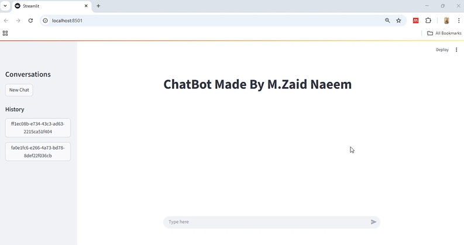

# 16.Context-Aware, Memory-Boosted Chat Model

I built a chatbot that doesn’t just respond — it remembers.
This model stores the entire conversation history across sessions, so every interaction feels like a true continuation rather than a reset.

By combining the workflow control of LangGraph with the intelligence of LangChain, enhancing text understanding through stemming, and preserving context in an SQL database, I’ve created a conversational AI that feels significantly more natural and reliable.

🚀 What Makes It Stand Out:
Most chatbots start fresh each time you talk to them.
This one remembers your past messages — whether from minutes ago or weeks ago — and uses that memory to give relevant, consistent replies.

📌 How It Works:

State Management & Workflow Creation with LangGraph – A node-based conversational graph that defines dialogue flow, branching logic, and context handling.

🧠 Hugging Face LLM via LangChain – Uses a fine-tuned Hugging Face model to generate intelligent, context-aware responses.

💾 Persistent Memory in SQL Database – Every conversation is stored for future recall, enabling truly continuous and personalized interactions.

🧵 Threading for Multiple Conversations – Supports separate conversation threads so different chats can run simultaneously without mixing histories.

💬 Custom UI for Interaction – A clean, responsive interface designed for smooth, real-time chatting.

🔄 Context-Aware Replies – Every message takes into account all relevant past messages in the thread for coherent, natural conversations.

📊 Graph-Driven Logic – LangGraph visually maps out the conversation flow, making it adaptive and maintainable.

⚡ Word-by-Word Streaming – Replies are streamed one word at a time for a dynamic, real-time chat experience similar to ChatGPT.

🛠 Tech Stack:
LangGraph | LangChain | Python | SQL Database | NLP (Stemming) | Streamlit

🌍 Why This Matters:
Perfect for virtual assistants, customer support systems, and knowledge bots — anywhere that context and memory create a more human-like and trustworthy experience.
